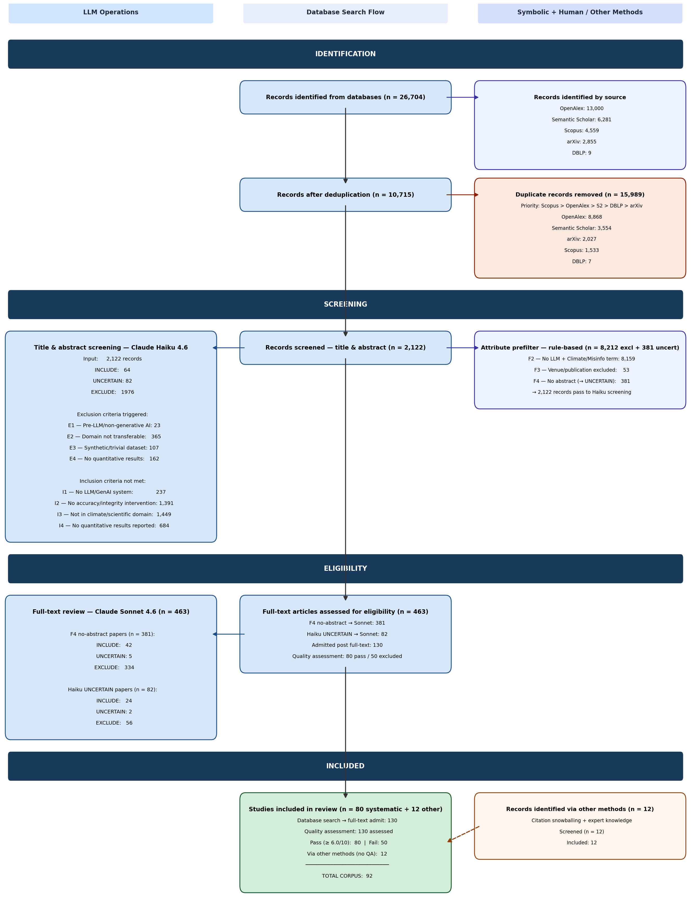

# Awesome Climate Information Integrity in LLMs [Awesome](https://awesome.re) [License: CC0-1.0](LICENSE)

> A curated list of research on detecting, mitigating, and correcting climate and scientific **misinformation, hallucination, and factual inaccuracy in large language models (LLMs)**.

The [2025 COP30 Declaration on Information Integrity on Climate Change](https://www.unesco.org/en/information-integrity-climate-change) marks the first
international climate agreement to formally recognise information integrity as a policy priority,
reflecting growing evidence that LLM-generated misinformation poses [measurable risks to public scientific literacy and climate communication](https://www.ipie.info/research/sr2025-1). Climate information integrity is a nuanced
challenge: it encompasses not only factual accuracy and knowledge retrieval, but also scientific
accuracy across climate science and adjacent fields (ecology, atmospheric science, energy systems), and raises broader questions about [responsible deployment in science communication](https://journals.sagepub.com/doi/10.1177/09636625251393621) and [future of climate communication](https://www.nature.com/articles/s43247-026-03514-y).

"[Information integrity](https://www.un.org/en/information-integrity)" — the accuracy, consistency, and reliability of information — has a sharper meaning for climate science than for open-domain facts. [Climate claims are](https://www.ipcc.ch/site/assets/uploads/2017/08/AR5_Uncertainty_Guidance_Note.pdf) **conditional, consensus-driven, and authoritatively sourced**: their truth value depends on scenario, timeframe, and confidence level, and is anchored in bodies like the IPCC and WMO rather than in a single retrievable fact. That makes climate a stress test for LLM factuality, and it maps onto three failure modes that the corpus repeatedly documents:

- **Internalisation** — models absorb climate misinformation present in pretraining data and reproduce it on demand, sometimes with no measurable degradation on unrelated benchmarks.
- **Distortion** — even when not strictly "wrong," models flatten scientific uncertainty, mis-state confidence, or drift toward over- or under-estimation of severity.
- **Amplification at scale** — as general-purpose knowledge systems for the public, journalists, educators, and policymakers, LLMs can generate persuasive climate falsehoods cheaply and at volume.

The list maps the **intervention-oriented** literature: technical approaches that aim to make LLM outputs on climate and adjacent scientific topics more trustworthy. It is the curated output of a systematic literature review; the [methodology](#methodology) and quality-assessment scores are summarised below, while the underlying review report is not published here (in-progress).

## Why we look beyond "climate" alone

Climate information integrity is a **niche slice of a much larger problem**. Searching only for climate-labelled papers would surface a handful of domain tools and miss almost all of the methods that actually determine whether an LLM tells the truth — about climate. The mechanisms are not climate-specific but they are general properties of how language models represent, retrieve, and verify factual claims. So this list deliberately treats climate integrity as the **intersection of four adjacent research programmes**:

- **LLM misinformation & disinformation** — how models generate, spread, or can be made to detect false claims. Climate is one high-stakes instance of this, and the detection/fact-checking machinery is largely shared.
- **Hallucination** — unsupported or fabricated output. A model that hallucinates a citation or a statistic fails climate integrity even with no adversarial intent, so hallucination detection and mitigation are core, not adjacent.
- **Scientific factuality & accuracy** — grounding generation in authoritative, peer-reviewed evidence. Because climate claims are consensus-driven and conditional, the relevant baselines come from general scientific-QA, claim-verification, and factuality-tuning work.
- **Knowledge editing & unlearning** — modifying what a model "believes." Whether a learned falsehood can be removed (and stays removed) is studied mostly outside climate, but directly governs what climate mitigation is even possible.

Put differently: the **constraint** is climate's scientific accuracy and authoritative sourcing, but the **solution space** is domain-general. The most methodologically relevant interventions like RAG robustness benchmarks, hallucination-detection frameworks, fine-tuning for factuality are evaluated on fake-news, social media, multi-domain, or general-science data. 

Restricting the corpus to climate-only studies would have excluded exactly the work that answers "what makes an LLM reliable on climate?" That is why the search axes (below) pair a *climate / scientific-accuracy domain* with general *misinformation, hallucination, and factuality* terms, and why entries that never mention climate still earn a place when their method transfers.

## How this list was built

Entries come from a systematic search executed on **April 2026** across five bibliographic APIs — **arXiv, DBLP, OpenAlex, Scopus, and Semantic Scholar**. We ran 13 structured Boolean queries.

The raw **26,704 records** were deduplicated, keyword pre-filtered, and screened by title/abstract, then full-text reviewed and scored against a 10-criterion quality rubric. **78 studies** passed the threshold (QA ≥ 6.0); a further **12** were added via citation snowballing and expert knowledge, **90-paper corpus**. Full counts, criteria, and the search protocol are in [Methodology](#methodology).

- The full machine-readable corpus lives in `[assets/corpus.json](assets/corpus.json)`; BibTeX for every entry is in `[assets/references.bib](assets/references.bib)`.

## Contents

- [Awesome Climate Information Integrity in LLMs Awesome License: CC0-1.0](#awesome-climate-information-integrity-in-llms-awesome-license-cc0-10)
  - [Why we look beyond "climate" alone](#why-we-look-beyond-climate-alone)
  - [How this list was built](#how-this-list-was-built)
  - [Contents](#contents)
  - [Interventions by Paradigm](#interventions-by-paradigm)
    - [Retrieval-Augmented Generation (RAG) (17)](#retrieval-augmented-generation-rag-17)
    - [Fine-Tuning \& Domain Adaptation (13)](#fine-tuning--domain-adaptation-13)
    - [Machine Unlearning (2)](#machine-unlearning-2)
    - [Fact-Checking Pipelines (9)](#fact-checking-pipelines-9)
    - [Hallucination \& Misinformation Detection (12)](#hallucination--misinformation-detection-12)
    - [Knowledge Editing \& Mechanistic Interpretability (3)](#knowledge-editing--mechanistic-interpretability-3)
  - [Benchmarks, Surveys \& Evaluation Studies](#benchmarks-surveys--evaluation-studies)
    - [Benchmarks \& Datasets (11)](#benchmarks--datasets-11)
    - [Surveys \& Reviews (8)](#surveys--reviews-8)
    - [Evaluation \& Analysis Studies (15)](#evaluation--analysis-studies-15)
  - [Methodology](#methodology)
    - [Generative AI usage](#generative-ai-usage)
  - [Contributing](#contributing)
  - [License](#license)

## Interventions by Paradigm

Studies that propose or evaluate a mitigation, grouped by **intervention paradigm** and ordered by quality-assessment score within each group. The review organises them along a **task-complexity axis** from binary verdict tasks (high inter-annotator reliability, clean automated metrics) up to open-ended long-form generation (where capability gaps are largest and automated metrics least validated). ⭐ marks high QA scores and the foundational studies (curator's pick).

### Retrieval-Augmented Generation (RAG) (17)

- **[Contradiction to Consensus: Dual Perspective, Multi Source Retrieval Based Claim Verification with Source Level Disagreement using LLM](https://arxiv.org/abs/2602.18693)** ⭐  
Dual-perspective multi-source retrieval for claim verification.
- **[Automated fact-checking of climate claims with large language models](http://dx.doi.org/10.1038/s44168-025-00215-8)** ⭐ — Leippold et al. — *npj Climate Action* (2025)  
Retrieval pipeline for automated climate fact-checking.
- **[Web Retrieval Agents for Evidence-Based Misinformation Detection](https://arxiv.org/abs/2409.00009)** ⭐  
Web-retrieval agents for evidence-based misinformation detection.
- **[EmeraldMind: A Knowledge Graph-Augmented Framework for Greenwashing Detection](https://arxiv.org/abs/2512.11506)**  
EmeraldMind: KG-augmented RAG for greenwashing detection.
- **[CAIRNS: Balancing Readability and Scientific Accuracy in Climate Adaptation Question Answering](https://arxiv.org/abs/2512.02251)**  
CAIRNS: balancing readability and scientific accuracy.
- **[SimulRAG: Simulator-based RAG for Grounding LLMs in Long-form Scientific QA](https://arxiv.org/abs/2509.25459)**  
SimulRAG: simulator-grounded RAG for scientific QA.
- **[CF-RAG: A Dataset and Method for Carbon Footprint QA Using Retrieval-Augmented Generation](https://arxiv.org/abs/2508.03489)**  
CF-RAG: RAG for carbon footprint QA — domain-specific.
- **[Beyond Retrieval: Improving Evidence Quality for LLM-based Multimodal Fact-Checking](https://arxiv.org/abs/2505.03135)**  
Beyond retrieval: evidence quality for multimodal fact-checking.
- **[Listen to the Context: Towards Faithful Large Language Models for Retrieval Augmented Generation on Climate Questions](https://arxiv.org/abs/2505.15633)**  
Faithful LLMs for RAG: context-following intervention.
- **[CtrlRAG: Black-box Document Poisoning Attacks for Retrieval-Augmented Generation of Large Language Models](https://arxiv.org/abs/2503.06950)**  
CtrlRAG: adversarial document poisoning — robustness baseline.
- **[A Large Language Model-based Framework to Retrieve Life Cycle Inventory and Environmental Impact Data from Scientific Literature](http://dx.doi.org/10.1021/acs.est.5c05955)** — Kumar et al. — *Environmental Science & Technology* (2025)  
LLM-based framework for life cycle inventory retrieval.
- **[Language models for the analysis of and interaction with climate change documents](http://dx.doi.org/10.1017/eds.2025.10024)** — Volkanovska — *Environmental Data Science* (2025)  
LMs for analysis of and interaction with climate documents.
- **[Towards More Robust Retrieval-Augmented Generation: Evaluating RAG Under Adversarial Poisoning Attacks](https://arxiv.org/abs/2412.16708)**  
Robustness evaluation of RAG under adversarial conditions.
- **[Verif.ai: Towards an Open-Source Scientific Generative Question-Answering System with Referenced and Verifiable Answers](https://arxiv.org/abs/2402.18589)**  
Verif.ai: open-source scientific generative QA system.
- **[Enabling GPTs for Expert-Level Environmental Engineering Question Answering](http://dx.doi.org/10.1021/acs.estlett.4c00665)** — Zhu et al. — *Environmental Science & Technology Letters* (2024)  
Enabling GPTs for expert-level environmental engineering QA.
- **[My Climate Advisor: An Application of NLP in Climate Adaptation for Agriculture](http://dx.doi.org/10.18653/v1/2024.climatenlp-1.3)** — Nguyen et al. — *Proceedings of the 1st Workshop on Natural Language Processing Meets Climate Change (ClimateNLP 2024)* (2024)  
My Climate Advisor: NLP application for climate adaptation.
- **[ChatClimate: Grounding conversational AI in climate science](http://dx.doi.org/10.1038/s43247-023-01084-x)** — Vaghefi et al. — *Communications Earth & Environment* (2023)  
ChatClimate: RAG-grounded climate conversational AI.

### Fine-Tuning & Domain Adaptation (13)

- **[PretrainRL: Alleviating Factuality Hallucination of Large Language Models at the Beginning](https://arxiv.org/abs/2602.01875)** ⭐  
PretrainRL: RL-based pretraining to reduce factuality hallucination.
- **[Learn and Unlearn: Addressing Misinformation in Multilingual LLMs](http://dx.doi.org/10.18653/v1/2025.emnlp-main.516)** ⭐ — Lu et al. — *Proceedings of the 2025 Conference on Empirical Methods in Natural Language Processing* (2025)  
Learn & Unlearn: SFT + machine unlearning for multilingual LLMs.
- **[Adapting While Learning: Grounding LLMs for Scientific Problems with Intelligent Tool Usage Adaptation](https://arxiv.org/abs/2411.00412)** ⭐  
Adapting While Learning: domain grounding via continual fine-tuning.
- **[ClimateGPT: Towards AI Synthesizing Interdisciplinary Research on Climate Change](https://arxiv.org/abs/2401.09646)** ⭐  
ClimateGPT: fine-tuned LLM synthesising climate research.
- **[Inducing Epistemological Humility in Large Language Models: A Targeted SFT Approach to Reducing Hallucination](https://arxiv.org/abs/2603.17504)**  
Targeted SFT to induce epistemic humility in LLMs.
- **[Leveraging LLMs for Environmental Complexity: Structured Fine-Tuning Data Sets and Deployment Strategies](http://dx.doi.org/10.1021/acs.est.5c09526)** — Chen et al. — *Environmental Science & Technology* (2026)  
Structured fine-tuning datasets for environmental domain LLMs.
- **[ClimateChat: Designing Data and Methods for Instruction Tuning LLMs to Answer Climate Change Queries](https://arxiv.org/abs/2506.13796)**  
ClimateChat: instruction-tuning dataset for climate QA.
- **[Just as Humans Need Vaccines, So Do Models: Model Immunization to Combat Falsehoods](https://arxiv.org/abs/2505.17870)**  
Model immunisation against misinformation (vaccine analogy).
- **[Fine-tuning large language models for interdisciplinary environmental challenges](http://dx.doi.org/10.1016/j.ese.2025.100608)** — Zhang et al. — *Environmental Science and Ecotechnology* (2025)  
Fine-tuning LLMs for interdisciplinary environmental challenges.
- **[Arabic Mini-ClimateGPT: A Climate Change and Sustainability Tailored Arabic LLM](http://dx.doi.org/10.18653/v1/2023.findings-emnlp.941)** — Mullappilly et al. — *Findings of the Association for Computational Linguistics: EMNLP 2023* (2023)  
Arabic Mini-ClimateGPT: fine-tuned Arabic climate LLM.
- **[ClimateBERT-NetZero: Detecting and Assessing Net Zero and Reduction Targets](http://dx.doi.org/10.18653/v1/2023.emnlp-main.975)** — Schimanski et al. — *Proceedings of the 2023 Conference on Empirical Methods in Natural Language Processing* (2023)  
Fine-tunes ClimateBERT for policy-commitment claims absent from main corpus.
- **[Fine-tuning Language Models for Factuality](https://arxiv.org/abs/2311.08401)**  
Fine-tuning language models for factuality — general domain.
- **[ClimateBERT: A Pretrained Language Model for Climate-Related Text](https://arxiv.org/abs/2110.12010)**  
Domain-specific BERT predecessor to ClimateGPT; grounds domain-adaptation axis.

### Machine Unlearning (2)

- **[Unlearning Climate Misinformation in Large Language Models](http://dx.doi.org/10.18653/v1/2024.climatenlp-1.14)** ⭐ — Fore et al. — *Proceedings of the 1st Workshop on Natural Language Processing Meets Climate Change (ClimateNLP 2024)* (2024)  
Machine unlearning of climate misinformation from LLM weights.
- **[Elastic Robust Unlearning of Specific Knowledge in Large Language Models](https://openreview.net/forum?id=VrXjAfdwrN)**  
ILU framework: IRM-based unlearning robustness against relearning.

### Fact-Checking Pipelines (9)

- **[Debate-to-Detect: Reformulating Misinformation Detection as a Real-World Debate with Large Language Models](http://dx.doi.org/10.18653/v1/2025.emnlp-main.764)** ⭐ — Han et al. — *Proceedings of the 2025 Conference on Empirical Methods in Natural Language Processing* (2025)  
Debate-to-Detect: multi-agent debate as fact-checking pipeline.
- **[Towards Reliable Misinformation Mitigation: Generalization, Uncertainty, and GPT-4](http://dx.doi.org/10.18653/v1/2023.emnlp-main.395)** ⭐ — Pelrine et al. — *Proceedings of the 2023 Conference on Empirical Methods in Natural Language Processing* (2023)  
Reliable misinformation mitigation: generalisation + uncertainty.
- **[Multi-Sourced, Multi-Agent Evidence Retrieval for Fact-Checking](https://arxiv.org/abs/2603.00267)**  
Multi-sourced, multi-agent evidence retrieval for fact-checking.
- **[AI-Assisted Scientific Assessment: A Case Study on Climate Change](https://arxiv.org/abs/2602.09723)**  
AI-assisted scientific assessment of climate change claims.
- **[Atomic Reasoning for Scientific Table Claim Verification](https://arxiv.org/abs/2506.06972)**  
Atomic reasoning for scientific table claim verification.
- **[The ClimateCheck Shared Task: Scientific Fact-Checking of Social Media Claims about Climate Change](http://dx.doi.org/10.18653/v1/2025.sdp-1.24)** — Abu Ahmad et al. — *Proceedings of the Fifth Workshop on Scholarly Document Processing (SDP 2025)* (2025)  
ClimateCheck shared task: climate claim verification systems.
- **[Computational Fact-Checking of Online Discourse: Scoring Scientific Accuracy in Climate Change Related News Articles](http://dx.doi.org/10.1109/ICKG66886.2025.00055)** — Wittenborg et al. — *2025 IEEE International Conference on Knowledge Graph (ICKG)* (2025)  
Scoring scientific accuracy in online discourse.
- **[Interpretable Unified Language Checking](https://arxiv.org/abs/2304.03728)**  
Interpretable unified language checking pipeline.
- **[SciClops: Detecting and Contextualizing Scientific Claims for Assisting Manual Fact-Checking](http://dx.doi.org/10.1145/3459637.3482475)** — Smeros et al. — *Proceedings of the 30th ACM International Conference on Information & Knowledge Management* (2021)  
Pre-LLM baseline for scientific claim detection; anchors evaluation landscape.

### Hallucination & Misinformation Detection (12)

- **[Evaluating open-source Large Language Models for automated fact-checking](https://arxiv.org/abs/2503.05565)** ⭐  
Evaluation of open-source LLMs for automated fact-checking.
- **[Enhancing LLMs for Governance with Human Oversight: Evaluating and Aligning LLMs on Expert Classification of Climate Misinformation for Detecting False or Misleading Claims about Climate Change](https://arxiv.org/abs/2501.13802)** ⭐  
Enhancing LLMs for governance with human oversight and alignment.
- **[SelfCheckGPT: Zero-Resource Black-Box Hallucination Detection for Generative Large Language Models](http://dx.doi.org/10.18653/v1/2023.emnlp-main.557)** ⭐ — Manakul et al. — *Proceedings of the 2023 Conference on Empirical Methods in Natural Language Processing* (2023)  
SelfCheckGPT: zero-resource black-box hallucination detection.
- **[ARREST: Adversarial Resilient Regulation Enhancing Safety and Truth in Large Language Models](https://arxiv.org/abs/2601.04394)**  
ARREST: adversarial resilient safety and truth enforcement.
- **[Multimodal Climate Disinformation Detection: Integrating Vision-Language Models with External Knowledge Sources](https://arxiv.org/abs/2601.16108)**  
Multimodal climate disinformation detection (vision-language).
- **[An Ensemble Approach to Climate Misinformation Detection](http://dx.doi.org/10.5220/0014633100004084)** — Lei et al. — *Proceedings of the 21st International Conference on Computer Vision Theory and Applications* (2026)  
Ensemble approach to climate misinformation detection.
- **[Using Large Language Models to Detect and Debunk Climate Change Misinformation](http://dx.doi.org/10.3390/bdcc10010034)** — Shahbazi et al. — *Big Data and Cognitive Computing* (2026)  
LLMs to detect and debunk climate misinformation.
- **[Two Stage Context Learning with Large Language Models for Multimodal Stance Detection on Climate Change](https://arxiv.org/abs/2509.08024)**  
Two-stage context learning for multimodal stance detection.
- **[Sycophancy under Pressure: Evaluating and Mitigating Sycophantic Bias via Adversarial Dialogues in Scientific QA](https://arxiv.org/abs/2508.13743)**  
Sycophancy under pressure: evaluation and mitigation.
- **[Fake news detection: comparative evaluation of BERT-like models and large language models with generative AI-annotated data](http://dx.doi.org/10.1007/s10115-024-02321-1)** — Raza et al. — *Knowledge and Information Systems* (2025)  
Comparative evaluation of BERT-like and LLMs for fake news.
- **[Detecting hallucinations in large language models using semantic entropy](http://dx.doi.org/10.1038/s41586-024-07421-0)** — Farquhar et al. — *Nature* (2024)  
Semantic entropy for hallucination detection in LLMs.
- **[Can LLM-Generated Misinformation Be Detected?](https://arxiv.org/abs/2309.13788)**  
Detectability of LLM-generated vs human-written misinformation; bridges DETECTION gap.

### Knowledge Editing & Mechanistic Interpretability (3)

- **[Reviving Your MNEME: Predicting The Side Effects of LLM Unlearning and Fine-Tuning via Sparse Model Diffing](http://dx.doi.org/10.18653/v1/2025.emnlp-main.1641)** — Kassem et al. — *Proceedings of the 2025 Conference on Empirical Methods in Natural Language Processing* (2025)  
Sparse probing of unlearning side effects on unrelated knowledge.
- **[Layer of Truth: Probing Belief Shifts under Continual Pre-Training Poisoning](https://arxiv.org/abs/2510.26829)**  
Probing belief shift resistance under continual pre-training poisoning.
- **[Can Knowledge Editing Really Correct Hallucinations?](https://arxiv.org/abs/2410.16251)**  
Mechanistic interpretability gap — HalluEditBench evaluates ROME/MEMIT knowledge editing.

## Benchmarks, Surveys & Evaluation Studies

*Cited in the review for context but excluded from the intervention corpus (no proposed mitigation system).*

### Benchmarks & Datasets (11)

- **[LLM Benchmark-User Need Misalignment for Climate Change](https://arxiv.org/abs/2603.26106)** ⭐  
Pure benchmark — LLM benchmark/user-need misalignment.
- **[CLINB: A Climate Intelligence Benchmark for Foundational Models](https://arxiv.org/abs/2511.11597)** ⭐  
Pure benchmark — CLINB (no proposed system).
- **[S2SServiceBench: A Multimodal Benchmark for Last-Mile S2S Climate Services](https://arxiv.org/abs/2602.14017)**  
Pure benchmark — S2SServiceBench.
- **[ESG-Bench: Benchmarking Long-Context ESG Reports for Hallucination Mitigation](http://dx.doi.org/10.1609/aaai.v40i46.41281)** — Sun et al. — *Proceedings of the AAAI Conference on Artificial Intelligence* (2026)  
ESG-Bench: hallucination mitigation in long ESG reports.
- **[ESGenius: Benchmarking LLMs on Environmental, Social, and Governance (ESG) and Sustainability Knowledge](http://dx.doi.org/10.18653/v1/2025.emnlp-main.739)** — He et al. — *Proceedings of the 2025 Conference on Empirical Methods in Natural Language Processing* (2025)  
Pure benchmark — ESGenius.
- **[Benchmarking LLM Faithfulness in RAG with Evolving Leaderboards](http://dx.doi.org/10.18653/v1/2025.emnlp-industry.54)** — Tamber et al. — *Proceedings of the 2025 Conference on Empirical Methods in Natural Language Processing: Industry Track* (2025)  
FaithJudge + evolving RAG leaderboard; complements RAG faithfulness work.
- **[ClimateEval: A Comprehensive Benchmark for NLP Tasks Related to Climate Change](http://dx.doi.org/10.18653/v1/2025.climatenlp-1.13)** — Kurfali et al. — *Proceedings of the 2nd Workshop on Natural Language Processing Meets Climate Change (ClimateNLP 2025)* (2025)  
Pure benchmark — ClimateEval.
- **[CliME: Evaluating Multimodal Climate Discourse on Social Media and the Climate Alignment Quotient (CAQ)](http://dx.doi.org/10.18653/v1/2025.nlp4pi-1.4)** — Borah et al. — *Proceedings of the Fourth Workshop on NLP for Positive Impact (NLP4PI)* (2025)  
Pure benchmark/dataset — CliME.
- **[EnviroExam: Benchmarking Environmental Science Knowledge of Large Language Models](https://arxiv.org/abs/2405.11265)**  
Pure benchmark — EnviroExam.
- **[Holistic Evaluation of Language Models](http://dx.doi.org/10.1111/nyas.15007)** — Bommasani et al. — *Annals of the New York Academy of Sciences* (2023)  
Pure benchmark — HELM (evaluation framework).
- **[TruthfulQA: Measuring How Models Mimic Human Falsehoods](http://dx.doi.org/10.18653/v1/2022.acl-long.229)** — Lin et al. — *Proceedings of the 60th Annual Meeting of the Association for Computational Linguistics (Volume 1: Long Papers)* (2022)  
Pure benchmark — TruthfulQA.

### Surveys & Reviews (8)

- **[Information Integrity about Climate Science: A Systematic Review](http://dx.doi.org/10.61452/BTZP3426)** ⭐ — Elbeyi et al. — 2025  
IPIE systematic review of climate information integrity landscape; abstract-only.
- **[Combating Misinformation in the Age of LLMs: Opportunities and Challenges](http://dx.doi.org/10.1002/aaai.12188)** ⭐ — Chen et al. — *AI Magazine* (2024)  
Survey of full mitigation landscape; scoping and vocabulary gap.
- **[Hallucination to truth: a review of fact-checking and factuality evaluation in large language models](http://dx.doi.org/10.1007/s10462-025-11454-w)** — Rahman et al. — *Artificial Intelligence Review* (2026)  
Survey — Hallucination to truth (review).
- **[Applications of Generative Large Language Models in Environmental Science: A Systematic Review](http://dx.doi.org/10.21926/aeer.2503028)** — Raeissi et al. — *Advances in Environmental and Engineering Research* (2025)  
Survey — Applications of LLMs in environmental science.
- **[Generative AI and misinformation: a scoping review of the role of generative AI in the generation, detection, mitigation, and impact of misinformation](http://dx.doi.org/10.1007/s00146-025-02620-3)** — Park et al. — *AI & SOCIETY* (2025)  
Survey — Generative AI and misinformation (scoping review).
- **[Ethics, Generative AI and Science Communication](http://dx.doi.org/10.1177/09636625251393621)** — Feldman et al. — *Public Understanding of Science* (2025)  
Ethics of genAI in science communication; deployment context.
- **[A Comprehensive Survey of Hallucination in Large Language, Image, Video and Audio Foundation Models](http://dx.doi.org/10.18653/v1/2024.findings-emnlp.685)** — Sahoo et al. — *Findings of the Association for Computational Linguistics: EMNLP 2024* (2024)  
Survey — Comprehensive survey of hallucination.
- **[Generative Large Language Models in Automated Fact-Checking: A Survey](https://arxiv.org/abs/2407.02351)**  
Survey — LLMs in automated fact-checking.

### Evaluation & Analysis Studies (15)

- **[When AI sees hotter: Overestimation bias in large language model climate assessments](http://dx.doi.org/10.1177/09636625251351575)** ⭐ — Tamang et al. — *Public Understanding of Science* (2025)  
Evaluation-only — Overestimation bias in LLM climate assessments.
- **[Assessing the Effectiveness of GPT-4o in Climate Change Evidence Synthesis and Systematic Assessments: Preliminary Insights](http://dx.doi.org/10.18653/v1/2024.climatenlp-1.20)** ⭐ — Joe et al. — *Proceedings of the 1st Workshop on Natural Language Processing Meets Climate Change (ClimateNLP 2024)* (2024)  
Evaluation-only — Assessing GPT-4o for climate evidence synthesis.
- **[ClimateX: Do LLMs Accurately Assess Human Expert Confidence in Climate Statements?](https://arxiv.org/abs/2311.17107)** ⭐  
Evaluation-only — ClimateX: LLM confidence on climate statements.
- **[Assessing Large Language Models on Climate Information](https://arxiv.org/abs/2310.02932)** ⭐  
Evaluation-only — Assessing LLMs on climate information.
- **[Climate Knowledge in Large Language Models](https://arxiv.org/abs/2510.08043)**  
Evaluation-only — Climate knowledge in LLMs.
- **[Scaling Truth: The Confidence Paradox in AI Fact-Checking](https://arxiv.org/abs/2509.08803)**  
Evaluation-only — Confidence paradox in AI fact-checking.
- **[I'll believe it when I see it: Images increase misinformation sharing in Vision-Language Models](https://arxiv.org/abs/2505.13302)**  
Evaluation-only — Images increase misinformation sharing.
- **[Understanding Inequality of LLM Fact-Checking over Geographic Regions with Agent and Retrieval models](https://arxiv.org/abs/2503.22877)**  
Evaluation-only — Geographic inequality in LLM fact-checking via agent frameworks.
- **[The AI Annotator: Large Language Models’ Potential in Scoring Sustainability Reports](http://dx.doi.org/10.3390/systems13100899)** — Wu et al. — *Systems* (2025)  
Evaluation-only — AI Annotator for sustainability reports.
- **[Understanding Knowledge Drift in LLMs Through Misinformation](http://dx.doi.org/10.1007/978-3-031-82346-6_5)** — Fastowski et al. — *Discovering Drift Phenomena in Evolving Landscapes* (2025)  
Evaluation-only — Knowledge drift through misinformation.
- **[Investigating Factuality in Long-Form Text Generation: The Roles of Self-Known and Self-Unknown](https://arxiv.org/abs/2411.15993)**  
Evaluation-only — Factuality in long-form text generation.
- **[Disinformation Capabilities of Large Language Models](http://dx.doi.org/10.18653/v1/2024.acl-long.793)** — Vykopal et al. — *Proceedings of the 62nd Annual Meeting of the Association for Computational Linguistics (Volume 1: Long Papers)* (2024)  
Evaluation-only — Disinformation capabilities of LLMs.
- **[Evaluating ChatNetZero, an LLM-Chatbot to Demystify Climate Pledges](http://dx.doi.org/10.18653/v1/2024.climatenlp-1.6)** — Hsu et al. — *Proceedings of the 1st Workshop on Natural Language Processing Meets Climate Change (ClimateNLP 2024)* (2024)  
Evaluating ChatNetZero LLM chatbot on climate pledges.
- **[Generative AI tools can enhance climate literacy but must be checked for biases and inaccuracies](http://dx.doi.org/10.1038/s43247-024-01392-w)** — Atkins et al. — *Communications Earth & Environment* (2024)  
Evaluation-only — AI tools and climate literacy (commentary).
- **[On the Risk of Misinformation Pollution with Large Language Models](http://dx.doi.org/10.18653/v1/2023.findings-emnlp.97)** — Pan et al. — *Findings of the Association for Computational Linguistics: EMNLP 2023* (2023)  
Evaluation-only — Risk of misinformation pollution.

## Methodology

This list is derived from a systematic literature review conducted following the **PRISMA-ScR** (Scoping Review) protocol. The review asked which intervention-oriented LLM approaches exist for mitigating climate and scientific misinformation, and how they compare on accuracy, interpretability, robustness, and evidence quality.

**Search & screening (conducted 5–6 April 2026):**

| Stage                                                                                   | Count  |
| --------------------------------------------------------------------------------------- | ------ |
| Records identified across 5 databases (arXiv, DBLP, OpenAlex, Scopus, Semantic Scholar) | 26,704 |
| After deduplication                                                                     | 10,715 |
| After keyword pre-filter                                                                | 2,122  |
| Admitted to full-text review                                                            | 146    |
| **Passed quality assessment (QA ≥ 6.0/10)**                                             | **80** |
| — Primary intervention studies (QA ≥ 7.0)                                               | 31     |
| — Supplementary intervention studies (QA 6.0–6.5 / peripheral domain)                   | 21     |
| — Benchmarks, surveys & evaluation-only (cited for context)                             | 28     |
| Identified via citation snowballing & expert knowledge                                  | 12     |
| **Corpus before full-paper inspection**                                                 | **92** |
| — Removed on full-paper inspection (QA < 7.0)                                            | 2      |
| **Final corpus**                                                                        | **90** |

**PRISMA-ScR study selection flow:**

*Note: the flow diagram shows the 92-study corpus produced by the review; on full-paper inspection, 2 papers scoring below QA 7.0 were removed, giving the **final 90-paper corpus**.*

**Search strategy:** 13 structured Boolean queries combining six keyword groups under a Problem–Constraint–Solution vocabulary (climate/scientific domain × misinformation/hallucination/factuality × RAG/fine-tuning/unlearning/fact-checking/detection), run across five bibliographic APIs.

**Inclusion criteria:** reports an LLM system addressing misinformation, hallucination, or factual inaccuracy; proposes or evaluates an intervention; published 2020–2026 in English; QA ≥ 6.0/10.

**Quality assessment:** ten criteria (Q1–Q10) scored Y(1) / P(0.5) / N(0) on a 10-point scale covering intervention clarity, theoretical grounding, dataset validity, evaluation rigour, reproducibility, and generalisability. Corpus range 6.0–8.5, median 7.0. (⭐ >=8.0.)

**Intervention taxonomy:** five paradigms — Retrieval-Augmented Generation (RAG), Fine-Tuning & Domain Adaptation, Machine Unlearning, Fact-Checking Pipelines, and Hallucination/Misinformation Detection. A notable structural gap identified by the review is the near-absence of **mechanistic interpretability** methods (steering vectors, sparse autoencoders, knowledge editing) in the applied climate-AI corpus.

### Generative AI usage

Generative AI (Claude, Anthropic) was used throughout the underlying review, in each case at the direction of and under the supervision of the author:

- **Search pipeline & data scripts** — assisted in writing the API query scripts, deduplication and pre-filtering routines, BibTeX fetch utilities, and data-processing code for the 26,704 retrieved records.
- **Title & abstract screening** — using author-defined inclusion/exclusion criteria and task design, Claude Haiku, Sonnet, and Opus 4.6 classified titles and abstracts for eligibility; uncertain or borderline records were resolved by full-text review by the author. As a validation check, a random sample of **100 titles/abstracts** from the Haiku screening was manually audited against author labels, yielding a **92% agreement rate**.
- **Annotation web application** — Claude assisted in building the browser-based annotation interface used for title/abstract screening, evidence flagging, and structured data extraction (shown below).
- **Section flagging & data extraction** — using author-defined extraction categories and quality-assessment criteria, Claude Haiku, Sonnet, and Opus 4.6 identified relevant passages within full-text papers and populated initial extraction fields; all extracted data were reviewed and verified by the author.
- **LaTeX formatting** — assisted with document formatting, table construction, and structural editing of the report.

All research-design decisions — review scope, search vocabulary, inclusion/exclusion criteria, quality-assessment thresholds, thematic groupings, and interpretive conclusions — were made by the author, who claims responsibility for the accuracy, coherence, and defensibility of all content.

*Annotation web app — quality-assessment view (ClimateX, arXiv:2311.17107), with the ten QA criteria scored Y/P/N on the right.*

## Contributing

Contributions are welcome! Please read [CONTRIBUTING.md](CONTRIBUTING.md) first. In short: open a pull request adding a paper to the relevant section, keep the entry format consistent (linked title — first author et al. — *venue* (year) — one-line description), and prefer a DOI or arXiv link. Suggestions to refine the taxonomy are also welcome via issues.

## License

[CC0](LICENSE)

To the extent possible under law, the curators have waived all copyright and related or neighboring rights to this work ([CC0 1.0](LICENSE)). Linked papers remain under their respective authors' and publishers' rights.